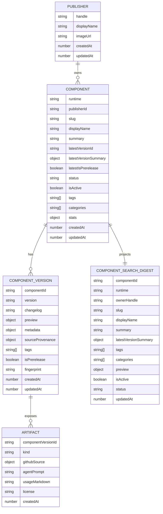

# RemotionHub MVP Catalog Design

## Status

Accepted for review.

## Context

RemotionHub is a catalog and sharing platform for Remotion and HyperFrames assets. The first release assumes a single publisher, Terence, curates assets through local catalog declarations and imports them into Convex. Downloaders browse by runtime, type, tags, and preview, then use GitHub source links and agent prompts to integrate assets into local Remotion or AI coding agent workflows.

ClawHub is the main reference. It uses Convex as its primary data store, stores long-lived public entries separately from immutable versions, and keeps lightweight search/list projections for public browsing. RemotionHub should learn from those boundaries without copying ClawHub's full moderation, upload, scan, org, CLI, and package registry complexity into the first MVP.

RemotionLab's showcase pages are the visual reference for the MVP browse cards and detail content. The reference pattern is preview-first: browse cards are image-led and sparse, while detail pages lead with a large video preview, then metadata, prompt, and source/code content.

## Goals

- Store the public catalog in Convex. Production pages must read from the database, not local JSON files.
- Keep a stable three-layer domain model: `Component`, `ComponentVersion`, and `Artifact`.
- Support both Remotion and HyperFrames as first-class public routes.
- Let Terence maintain local catalog declarations and import them into Convex.
- Show manually provided preview URLs.
- Provide GitHub source links, usage notes, and copyable agent prompts as the first download/use path.
- Support exact filtering by runtime, categories, tags, and aspect ratio. Do not implement full-text or fuzzy search in the MVP.
- Start with a ClawHub-like testing posture: unit tests, Convex contract tests, route/component tests, and Playwright smoke tests.

## Non-Goals

- No public upload form in the first MVP.
- No admin dashboard in the first MVP.
- No platform-hosted zip or tarball downloads in the first MVP.
- No automatic GitHub repository build or dependency installation in the first MVP.
- No automatic Remotion or HyperFrames preview rendering in the first MVP.
- No full-text search, fuzzy search, vector search, or recommendation ranking in the first MVP.
- No security scanner, moderation queue, reports, comments, stars, paid features, or full download metrics in the first MVP.
- No multi-runtime component record in the first MVP. A Remotion asset and a HyperFrames asset are separate components, even if they share a slug.

## Decisions

### Database

Use Convex as the MVP database and backend runtime.

Convex is a deliberate match for the ClawHub reference architecture. The production source of truth is Convex. Local catalog files are only import inputs for development, linting, testing, and review.

### Public Routing

Use runtime-specific canonical routes:

```text
/remotion
/remotion/$owner/$slug
/hyperframes
/hyperframes/$owner/$slug
```

The homepage `/` may show a combined catalog with runtime tabs, but canonical detail pages must be runtime-specific. This follows the same product logic as ClawHub's separated surfaces such as skills, plugins, and packages.

Do not expose `/components/$owner/$slug` as the public canonical route in the first MVP.

### Internal Naming

The internal domain object is still named `Component`. This keeps the model stable across Remotion and HyperFrames while public routes speak in product-specific language.

The detail lookup must include runtime:

```ts
components.listCatalog({ runtime: "remotion" })
components.listCatalog({ runtime: "hyperframes" })
components.getCatalogDetail({ runtime: "remotion", owner, slug })
components.getCatalogDetail({ runtime: "hyperframes", owner, slug })
```

### Uniqueness

Public identity is scoped by runtime, publisher handle, and slug:

```text
(runtime, publisherHandle, slug)
```

This allows the following entries to coexist:

```text
/remotion/terence/intro-pack
/hyperframes/terence/intro-pack
```

Internal storage should use Convex IDs:

```text
(runtime, publisherId, slug)
```

The importer must resolve catalog `publisher` handles to `publisherId` values before writing components. Public routes and digests store `ownerHandle` for URL generation and card rendering, but canonical table references use `publisherId`.

Publisher handles and component slugs must be URL-safe. MVP validation should use lowercase ASCII slugs:

```text
publisherHandle: ^[a-z0-9](?:[a-z0-9-]{0,38}[a-z0-9])?$
componentSlug: ^[a-z0-9](?:[a-z0-9-]{0,78}[a-z0-9])?$
```

Display names and tags may contain richer text, but route parameters must use validated handles and slugs. Frontend route generation should still encode path parameters through router/link APIs instead of manual string concatenation.

### Status

Do not use `softDeletedAt` as the primary public query condition. Use explicit status and active projection fields:

```ts
status: "draft" | "published" | "unlisted" | "removed"
isActive: boolean
```

Status semantics:

- `draft`: imported or edited but not publicly visible.
- `published`: visible in public browse pages and detail pages.
- `unlisted`: hidden from public browse pages but accessible by direct URL.
- `removed`: unavailable to public users, retained for audit and future operational needs.

`isActive` is the list-query hot-path projection, normally equivalent to `status === "published"`.

Use these indexes:

```ts
by_active_updated: ["isActive", "updatedAt"]
by_status_updated: ["status", "updatedAt"]
```

`softDeletedAt` may exist later as an audit timestamp, but it is not the catalog query model.

### Latest Version

Latest version selection must be semver-based, not import-order-based.

Default public latest only selects stable versions. A prerelease such as `2.0.0-alpha.1` must not replace stable `1.2.0` as the default public latest. If a component has no stable versions, the highest prerelease may be used as a fallback and must be marked with `latestIsPrerelease: true`.

Future dist tags such as `next` or `beta` should be explicit tags, not a replacement for stable latest.

Convex string indexes must not be used for semver ordering. The import mutation must compare candidate versions in memory with a semver parser, because lexical string order is wrong for versions such as `1.10.0` and `1.2.0`.

The semver parser used inside Convex must be pure JavaScript and compatible with the Convex runtime. If the chosen library has Node.js native dependencies or runtime incompatibilities, the external import script may compute latest candidate metadata and pass it to the mutation, while the mutation still validates that the provided latest is consistent with stored versions.

### Search Scope

MVP catalog browsing supports deterministic filtering only:

- runtime
- categories
- tags
- aspect ratio
- sort by updated, newest, or name

Do not implement full-text fuzzy search in the MVP. If a text input appears in the UI, it must be treated as a future feature placeholder or omitted entirely. Public query design should not require a search index until a later search milestone.

## Domain Model



### Publisher

`Publisher` represents the catalog owner. The first MVP can seed only Terence, but the schema should keep the owner relationship explicit to avoid future migration when more publishers are introduced.

Required fields:

- `handle`
- `displayName`
- `imageUrl`
- `createdAt`
- `updatedAt`

Index:

- `by_handle`

### Component

`Component` is the long-lived public entry. It stores stable listing fields and the latest version projection.

Required fields:

- `runtime`: `remotion` or `hyperframes`
- `publisherId`
- `slug`
- `displayName`
- `summary`
- `categories`
- `tags`
- `status`
- `isActive`
- `latestVersionId`
- `latestVersionSummary`
- `stats`
- `createdAt`
- `updatedAt`

Indexes:

- `by_runtime_publisher_slug`
- `by_active_updated`
- `by_status_updated`

Invariants:

- `(runtime, publisherId, slug)` is unique.
- A component without a latest version must not appear in public browse pages.
- Component-level display fields should follow the selected public latest version only when the imported catalog intends to update the stable entry.
- Public route resolution maps `(runtime, publisherHandle, slug)` to `(runtime, publisherId, slug)`.

### ComponentVersion

`ComponentVersion` is an immutable release unit.

Required fields:

- `componentId`
- `version`
- `changelog`
- `preview`
- `metadata`
- `sourceProvenance`
- `tags`
- `isPrerelease`
- `fingerprint`
- `createdAt`
- `updatedAt`

Indexes:

- `by_component_version`
- `by_component_created`

Invariants:

- `(componentId, version)` is unique.
- Published versions are immutable. If a version already exists, the import fingerprint must match or the import fails.
- Fixes require a new version.

### Artifact

`Artifact` describes how a downloader or coding agent can use the selected version.

MVP supports only:

```ts
kind: "github-source"
```

Required fields:

- `componentVersionId`
- `kind`
- `githubSource.repo`
- `githubSource.ref`
- `githubSource.commit`
- `githubSource.path`
- `license`
- `usageMarkdown`
- `agentPrompt`
- `createdAt`

Index:

- `by_version`

The GitHub source should be pinned to a commit or tag. If the catalog provides only a branch, the importer may accept it with `pinned: false`, but the detail page must show the weaker provenance clearly. The stricter long-term rule should require a commit.

`usageMarkdown` and `agentPrompt` live on the version artifact in the MVP because usage can change across versions. They must not be included in `ComponentSearchDigest`. If these fields become large or mostly identical across many versions, a later schema revision can move shared guidance to `Component` and keep only version-specific overrides on `Artifact`.

### ComponentSearchDigest

`ComponentSearchDigest` is a lightweight projection for browse/search pages. It avoids reading full component, version, and artifact records for every card.

Required fields:

- `componentId`
- `runtime`
- `ownerHandle`
- `slug`
- `displayName`
- `summary`
- `latestVersionSummary`
- `tags`
- `categories`
- `preview`
- `status`
- `isActive`
- `updatedAt`

Indexes:

- `by_active_updated`
- `by_status_updated`

The digest is runtime data. It is generated from canonical component/version records and can be rebuilt.

Digest synchronization must live inside Convex, not only in the external import script. The import mutation should call an internal helper such as `components.syncComponentSearchDigestInternal(componentId)`. Future dashboard mutations or admin fixes must use the same helper so manual DB-side changes do not bypass the projection rules.

## Catalog Input

Use local catalog declarations as import inputs:

```text
/catalog
  /components
    kinetic-title-pack.json
    podcast-waveform-intro.json
  schema.json
/scripts
  import-catalog.ts
```

Catalog JSON is not a production read path. Production pages, APIs, and detail views must read Convex.

Example declaration:

```json
{
  "publisher": "terence",
  "runtime": "remotion",
  "slug": "kinetic-title-pack",
  "displayName": "Kinetic Title Pack",
  "summary": "Reusable Remotion title animations for product videos.",
  "categories": ["title", "motion-graphics"],
  "tags": ["remotion", "text", "intro"],
  "status": "published",
  "versions": [
    {
      "version": "1.0.0",
      "changelog": "Initial release with three title variants.",
      "preview": {
        "thumbnailUrl": "https://example.com/title-pack.jpg",
        "previewVideoUrl": "https://example.com/title-pack.mp4",
        "demoUrl": "https://example.com/title-pack"
      },
      "metadata": {
        "runtime": "remotion",
        "entryPoint": "src/TitlePack.tsx",
        "aspectRatios": ["16:9", "9:16"],
        "durationFrames": 180,
        "fps": 30
      },
      "artifact": {
        "kind": "github-source",
        "githubSource": {
          "repo": "tangwz/remotionhub-assets",
          "ref": "v1.0.0",
          "commit": "abc123",
          "path": "components/kinetic-title-pack"
        },
        "license": "MIT",
        "usageMarkdown": "Install dependencies and copy the component folder into your Remotion project.",
        "agentPrompt": "Add the Kinetic Title Pack from tangwz/remotionhub-assets..."
      }
    }
  ]
}
```

## Import Workflow

The import script has two modes:

```bash
npm run catalog:import -- --dry-run
npm run catalog:import -- --apply
```

Workflow:

1. Read `/catalog/components/*.json`.
2. Validate declaration shape, slug, publisher handle, runtime, semver, URL, preview, and artifact fields.
3. Compute immutable fingerprints for each version.
4. Upsert publisher by handle.
5. Upsert component by `(runtime, publisher, slug)`.
6. Insert missing versions and artifacts.
7. For existing versions, compare fingerprints.
8. Fail hard on immutable conflicts.
9. Recompute stable latest and latest summary.
10. Call the Convex internal digest sync helper to rebuild `ComponentSearchDigest`.
11. Print an import report with `created`, `updated`, `skipped`, and `conflicts`.

Import behavior:

- Dry-run must not write Convex.
- Repeated apply must be idempotent.
- Each component import must be one Convex mutation call. Convex mutations are transactional, so a failed component import must not leave a partially updated component.
- A component import mutation should stay within Convex execution limits. MVP catalog files should remain small enough that one component plus its versions and artifacts can be processed in a single mutation. If a component grows to hundreds of versions or very large artifact text, the importer should fail with a clear size/complexity error and require a future chunked import design.
- The apply mode must require explicit privileged credentials, such as `CONVEX_DEPLOY_KEY` or a dedicated admin import token. These credentials must never be exposed to browser code.
- The import script must require an explicit target environment for writes, such as local dev or production, so accidental production writes are harder.
- Remote preview URL reachability is not a hard requirement. Validate URL shape only.
- Preview URLs must use `https://` by default. `http://` may be allowed only for local development fixtures.
- Missing artifact is a hard failure for published versions.
- Missing preview is allowed but should produce a warning and a fallback UI.

## Frontend Design

Use a catalog-first marketplace layout. The first screen should be useful for browsing, filtering, and comparing assets. Do not build a marketing landing page as the primary experience.

### Routes

```text
/                              Combined catalog, optional runtime tabs
/remotion                      Remotion catalog
/remotion/$owner/$slug          Remotion detail page
/hyperframes                   HyperFrames catalog
/hyperframes/$owner/$slug       HyperFrames detail page
```

### Browse Pages

Browse pages show:

- Runtime tabs or runtime-specific page title.
- Filters for category, tags, aspect ratio, and sort.
- Component cards with preview, name, summary, runtime, category, tags, and latest version.
- Cursor pagination with an infinite scroll interaction.
- Inline pagination loading, end-of-list, and retry states.
- Empty state for no results.
- Loading skeletons.
- Error alert.

Card design should follow the RemotionLab showcase pattern:

- Thumbnail dominates the card.
- Card body stays compact: title plus a small set of badges.
- Prefer three visible tags or badges on the card; move longer metadata to the detail page.
- Entire card is clickable.
- Cards use a stable preview aspect ratio and lazy-loaded media.
- Hover treatment should be subtle and should not resize the card.

Do not include fuzzy text search in the MVP. A later search milestone can add a search input after query semantics and indexes are designed.

### Detail Pages

Detail pages show:

- Back link to the runtime catalog.
- Preview image, preview video, or demo link.
- Component stable metadata.
- Selected version metadata.
- Runtime, entry point, aspect ratios, duration, fps, license, and tags.
- Version switcher.
- Changelog.
- GitHub source link.
- Usage markdown.
- Copyable agent prompt.

Detail content should follow the RemotionLab showcase pattern:

- A large preview video or poster appears before the title and long content.
- The header area contains date or version timestamp, title, short description, and tags.
- The agent prompt is a primary content block, displayed in an editable/copyable textarea-style surface.
- Source or usage code appears after the prompt, with copy actions.
- RemotionHub differs from RemotionLab by making GitHub source and agent prompt the primary access path instead of gated full code.

Detail routes should generate dynamic metadata with TanStack Start route metadata support. Page title and description should come from `components.getCatalogDetail` data, including component display name, runtime, owner handle, and summary. Missing or removed entries should use not-found metadata rather than generic catalog metadata.

Preview rendering must be defensive. Cards and detail pages should reserve a stable aspect ratio, lazy-load external images/video posters, and provide a fallback thumbnail when URLs fail. Broken third-party preview URLs must not collapse layout or block the rest of the detail page.

The primary action is not "download zip". The primary actions are "Open source" and "Copy agent prompt".

### shadcn/ui

The project should use shadcn/ui for UI composition.

Expected components:

- `Card`
- `Badge`
- `Button`
- `Input`
- `Select`
- `ToggleGroup`
- `Tabs`
- `Skeleton`
- `Empty`
- `Alert`
- `Tooltip`
- `sonner`

Implementation must follow the current project context:

- TanStack Start.
- Tailwind CSS v4.
- TypeScript.
- Import alias `#`.
- No React Server Components.

Use shadcn components as components, not as raw styled markup. Form and control layout must follow shadcn conventions when forms are introduced.

Before implementation, run `npx shadcn@latest info --json` and use the reported project context. Because this project uses Tailwind CSS v4 and TanStack Start, generated shadcn files and global CSS changes must be verified with the actual CLI output before adding components.

Preview image optimization is not a hard MVP requirement. The first version may render external URLs directly with defensive fallback behavior. A later milestone can add a Convex storage-backed mirror, image proxy, or thumbnail worker if third-party preview reliability becomes a user-visible problem.

Route links must be built with TanStack Router `Link` or `navigate` APIs so owner and slug path segments are encoded consistently. Do not manually concatenate unescaped URL strings.

## Convex Queries

Use these query names:

```ts
components.listCatalog
components.getCatalogDetail
```

### `components.listCatalog`

Input:

```ts
{
  runtime?: "remotion" | "hyperframes"
  tags?: string[]
  categories?: string[]
  aspectRatio?: string
  sort?: "updated" | "newest" | "name"
  cursor?: string
}
```

Behavior:

- Reads from `componentSearchDigest`.
- Public browse returns only `isActive === true`.
- Runtime-specific browse filters by runtime.
- MVP filtering is exact-match filtering by tags, categories, runtime, and aspect ratio.
- Uses Convex cursor pagination and returns results suitable for an infinite scroll UI. The frontend should trigger the next page with an intersection observer sentinel near the end of the list. If page loading fails, show an inline retry control without switching the primary browsing model back to manual pagination.
- Future search may add full-text or vector search in a separate milestone.

### `components.getCatalogDetail`

Input:

```ts
{
  runtime: "remotion" | "hyperframes"
  owner: string
  slug: string
  version?: string
}
```

Behavior:

- Resolves publisher handle and component slug within runtime.
- Allows `published` and `unlisted`.
- Rejects or hides `removed`.
- Defaults to stable latest.
- Allows explicit prerelease version lookup.
- Returns component, version list, selected version, artifact, and publisher summary.

## Error Handling

- Unknown detail route returns not found.
- Removed component returns not found for public users.
- Draft component is not visible publicly.
- Unlisted component is accessible only by exact URL.
- Missing artifact on a published version is an import error.
- Missing preview is allowed and rendered with a fallback.
- Unpinned GitHub source is allowed only if clearly marked as unpinned.
- Invalid external preview URLs must be isolated to preview UI fallback states and must not break page layout.

## Testing Strategy

Testing must be part of the MVP, not a later cleanup task. ClawHub's test posture is the reference: small pure unit tests, backend contract tests, route/component tests, and browser-level smoke tests.

### Catalog Unit Tests

Cover:

- Catalog JSON schema validation.
- Slug, publisher handle, runtime, semver, and URL validation.
- Slug and handle regex validation.
- Immutable fingerprint stability.
- Duplicate version rejection.
- Stable latest selection.
- Semver comparison in memory, including `1.10.0` ordering after `1.2.0`.
- Prerelease latest fallback behavior.
- Digest projection.

### Convex Contract Tests

Cover:

- `importCatalogComponent` create, skip, and conflict behavior.
- Repeated import idempotency.
- Version immutability conflict.
- `status` and `isActive` projection.
- Publisher handle to `publisherId` resolution.
- Internal digest sync helper usage from import mutations.
- `components.listCatalog` only returns active published entries.
- `components.getCatalogDetail` handles published, unlisted, draft, and removed entries.
- Runtime-scoped slug uniqueness.
- Explicit prerelease version lookup.

### Route and Component Tests

Cover:

- Combined catalog renders DB-backed cards.
- Runtime pages filter correctly.
- Filters update list state.
- Cards render image-first with compact title and badges.
- Detail route renders selected version, artifact, GitHub source, usage, and agent prompt.
- Detail route renders preview before title/metadata content.
- Missing preview fallback.
- Broken external preview URL fallback.
- Missing artifact alert in non-public or mocked broken state.
- Dynamic metadata title and description for detail routes.
- Copy prompt behavior with mocked clipboard and toast.

### Playwright Smoke and E2E Tests

MVP should include browser smoke tests from the first implementation pass.

Cover:

- Build and preview the real app.
- Desktop catalog browse.
- Mobile catalog browse.
- Infinite scroll on catalog pages.
- Open a Remotion detail page.
- Open a HyperFrames detail page.
- Switch version.
- Copy agent prompt.
- Assert no console errors.
- Assert core preview, metadata, source, and usage content are visible.
- Assert broken preview fixtures do not collapse layout.

### Suggested Commands

Initial commands:

```bash
npm run test
npm run build
npm run test:e2e
```

Future CI split:

```bash
npm run ci:static
npm run ci:unit
npm run ci:types-build
npm run ci:playwright-smoke
```

## Future Extensions

- CLI publish flow.
- GitHub import from repo, ref, and path.
- Convex storage-backed source archive.
- Remotion and HyperFrames preview worker.
- Public API endpoints.
- Full-text search and embedding search.
- Download metrics, stars, comments, and reports.
- Multi-publisher organizations and permissions.
- Security scanner and moderation queue.
- Runtime variant linking via `relatedComponentIds` or `crossRuntimeVariants`.

## Open Implementation Notes

- Add `.superpowers/` to `.gitignore` if this workspace becomes a git repository.
- The current workspace is not a git repository, so this spec cannot be committed from the current checkout.
- The existing `specs/feature_list.json` file is empty. This design intentionally uses `/spec` because that was the requested location.
