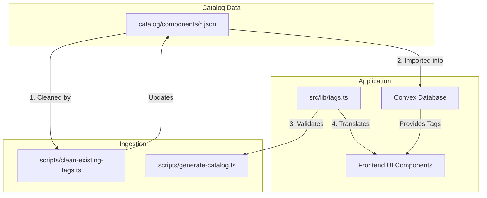

# Design Spec: Video Tags Refactor

**Date**: 2026-06-29  
**Status**: Approved  
**Topic**: Refactoring video tags into a curated, dual-language, centralized taxonomy.

---

## 1. Goal & Context

Currently, component tags in RemotionHub are automatically generated by splitting the component's `slug` by hyphens (e.g., `yt-arcade-beat-em-up` $\rightarrow$ `['animation', 'arcade', 'beat', 'em', 'up']`). This results in:
1. Over 300 unique tags, many of which are meaningless single words (e.g., `em`, `up`, `not`, `two`, `far`).
2. Extremely poor searchability and filterability for users.
3. No localized (Chinese) display support for tags.

To make tags readable and useful for filtering, we are refactoring them into a **centralized, curated, dual-language taxonomy** with exactly **6 core tags**.

---

## 2. Tag Taxonomy

We define a strict set of 6 tags that classify components by **visual style** and **intended use case / target audience**.

| Tag Key | English Label | Chinese Label | Description / Intended Use |
| :--- | :--- | :--- | :--- |
| `minimal` | Minimal | 极简 | Clean, simple designs with minimal decoration. |
| `retro` | Retro | 复古 | VHS, pixel-art, retro-gaming, vintage vibes. |
| `creative` | Creative | 创意 | Glitch, neon, 3D, cinematic, complex animations. |
| `business` | Business | 商务 | SaaS, presentations, dashboards, charts, finance. |
| `social` | Social | 社交 | YouTube, TikTok, Instagram, Twitter CTAs, feeds. |
| `personal` | Personal | 个人 | Avatars, profile cards, vlogs, portfolios. |

---

## 3. Proposed Changes

We will modify the codebase to support this taxonomy across data storage, ingestion, and the frontend.



### 3.1. Shared Library

#### [NEW] [tags.ts](file:///Users/tangwz/.gemini/antigravity/worktrees/remotionhub/refactor-remotion-data-migration/src/lib/tags.ts)
The single source of truth for the tag taxonomy.

```typescript
export type TagKey = 'minimal' | 'retro' | 'creative' | 'business' | 'social' | 'personal'

export interface TagInfo {
  en: string
  zh: string
}

export const TAG_DICTIONARY: Record<TagKey, TagInfo> = {
  minimal: { en: 'Minimal', zh: '极简' },
  retro: { en: 'Retro', zh: '复古' },
  creative: { en: 'Creative', zh: '创意' },
  business: { en: 'Business', zh: '商务' },
  social: { en: 'Social', zh: '社交' },
  personal: { en: 'Personal', zh: '个人' },
}

export function isValidTag(tag: string): tag is TagKey {
  return tag in TAG_DICTIONARY
}

export function getLocalizedTag(tag: string, locale: 'zh' | 'en'): string {
  if (isValidTag(tag)) {
    return locale === 'zh' ? TAG_DICTIONARY[tag].zh : TAG_DICTIONARY[tag].en
  }
  return tag
}
```

### 3.2. Data Ingestion & Migration

#### [NEW] [clean-existing-tags.ts](file:///Users/tangwz/.gemini/antigravity/worktrees/remotionhub/refactor-remotion-data-migration/scripts/clean-existing-tags.ts)
A one-time script to migrate the 263 existing JSON files under `catalog/components/`. It maps old tags to the new 6 tags based on heuristics:
- `vhs`, `retro`, `arcade`, `pixel` $\rightarrow$ `retro`
- `chart`, `dataviz`, `stats`, `gantt`, `candlestick`, `comparison`, `counter` $\rightarrow$ `business`
- `youtube`, `yt`, `social`, `facebook`, `tiktok`, `ig`, `twitter`, `reddit`, `linkedin`, `social-media` $\rightarrow$ `social`
- `avatar`, `profile`, `testimonial` $\rightarrow$ `personal`
- `glitch`, `neon`, `cinematic`, `blast`, `firework`, `3d`, `hologram` $\rightarrow$ `creative`
- `minimal`, `fade`, `slide`, `wipe`, `simple` $\rightarrow$ `minimal`

#### [MODIFY] [generate-catalog.ts](file:///Users/tangwz/.gemini/antigravity/worktrees/remotionhub/refactor-remotion-data-migration/scripts/generate-catalog.ts)
Update the tag generation logic:
- Replace `slug.split('-').slice(1)` with the heuristic mapping.
- Import `isValidTag` from `src/lib/tags.ts` to assert that all generated tags are valid keys.

### 3.3. Frontend Components

We will update all places displaying or filtering by tags to use the localization helper.

#### [MODIFY] [CatalogGrid.tsx](file:///Users/tangwz/.gemini/antigravity/worktrees/remotionhub/refactor-remotion-data-migration/src/components/catalog/CatalogGrid.tsx)
In `tagOptions`, translate the label of each facet option:
```typescript
const { locale } = useI18n()
// ...
const tagOptions = useMemo(() => {
  if (!facets) return []
  return Object.entries(facets.tags)
    .map(([value, count]) => ({
      value,
      label: getLocalizedTag(value, locale),
      count,
    }))
    .sort((a, b) => a.label.localeCompare(b.label, locale))
}, [facets, locale])
```

#### [MODIFY] [CatalogCard.tsx](file:///Users/tangwz/.gemini/antigravity/worktrees/remotionhub/refactor-remotion-data-migration/src/components/catalog/CatalogCard.tsx)
Translate the badges rendered on the catalog card using `getLocalizedTag(tag, locale)`.

#### [MODIFY] [DetailPage.tsx](file:///Users/tangwz/.gemini/antigravity/worktrees/remotionhub/refactor-remotion-data-migration/src/components/catalog/DetailPage.tsx)
Translate the badges rendered on the detail page using `getLocalizedTag(tag, locale)`.

---

## 4. Verification Plan

### 4.1. Automated Tests
1. Update existing unit tests for:
   - `CatalogCard.test.tsx`
   - `CatalogFilters.test.tsx`
   - `CatalogGrid.test.tsx`
   - `DetailPage.test.tsx`
2. Run `npm run test` to verify all tests pass with the new tag taxonomy.

### 4.2. Manual Verification
1. Run `npm run dev` to launch the local development server.
2. Visit `http://localhost:3000` (or local port) and toggle between English and Chinese languages.
3. Verify that the tag filter list displays only the 6 core tags, translated correctly in each language.
4. Verify that the tags on the card and detail page are correctly translated.
